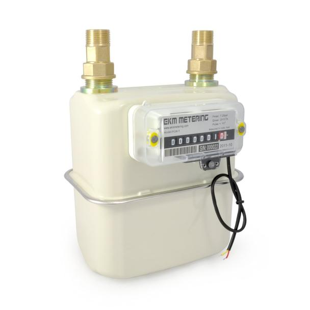
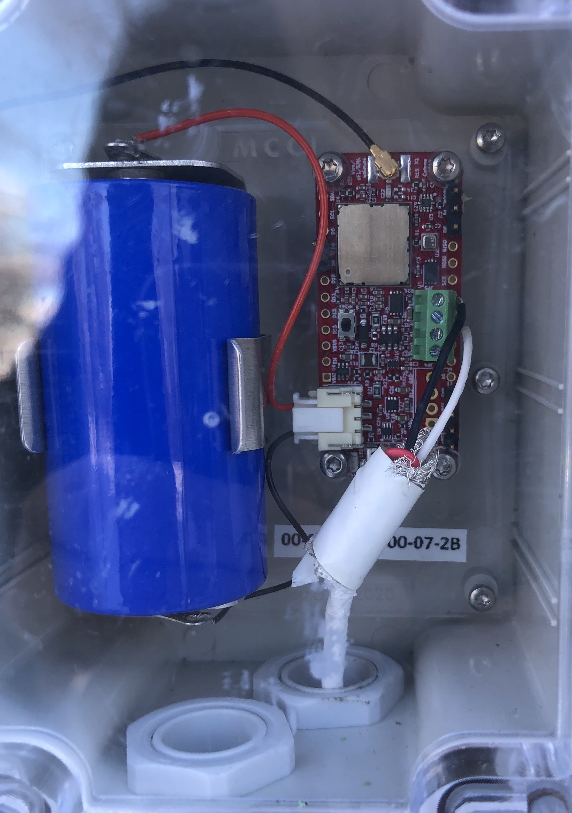

# catena4612-pulse-4861 -- Capture pulses for Model 4861 fuel-oil meter

## Assumptions

2-wire EKM Metering [PGM-075](https://www.ekmmetering.com/collections/gas-meters/products/3-4-pulse-output-gas-meter) pulse output meter, attached to A1, with GND from pin 4.

Here's a typical installation:

## Downlink commands

Downlink commands use the port number as the command index.

Port 1 controls the sample time. The message is either two or three bytes. If two bytes, the sample time (in seconds, big endian) is changed *temporarily* (for 30 uplinks). If three bytes, the third byte specifies how many samples should be sent at the new rate before reverting. If the third byte is zero, the sample time is set permanently (until reboot).

Port 2 controls rejoins. The message is two bytes, and specifies the number of seconds (big endian) to wait before rejoining. While waiting to rejoin, uplinks will not be initiated.

Port 3 controls reboots. The message is two bytes, and specifies the number of seconds (big endian) to wait before rejoining. While waiting to reboot, uplinks will not be initiated.

## Firmware update in field

This is a bit tricky, because an ST-LINK V2 doesn't like it when the operating voltage is 3V. The secret is to force 3.3V mode with a jumper.

1. Jumper JP1-1 to JP1-2 (tying EN to Vbat).  On early assemblies, this must be done with a clip-lead. On later units, there are posts in both positions, and you need only push on a jumper.

2. Attach the STLINK V2 as normal for 4612 debugging and firmward download.
